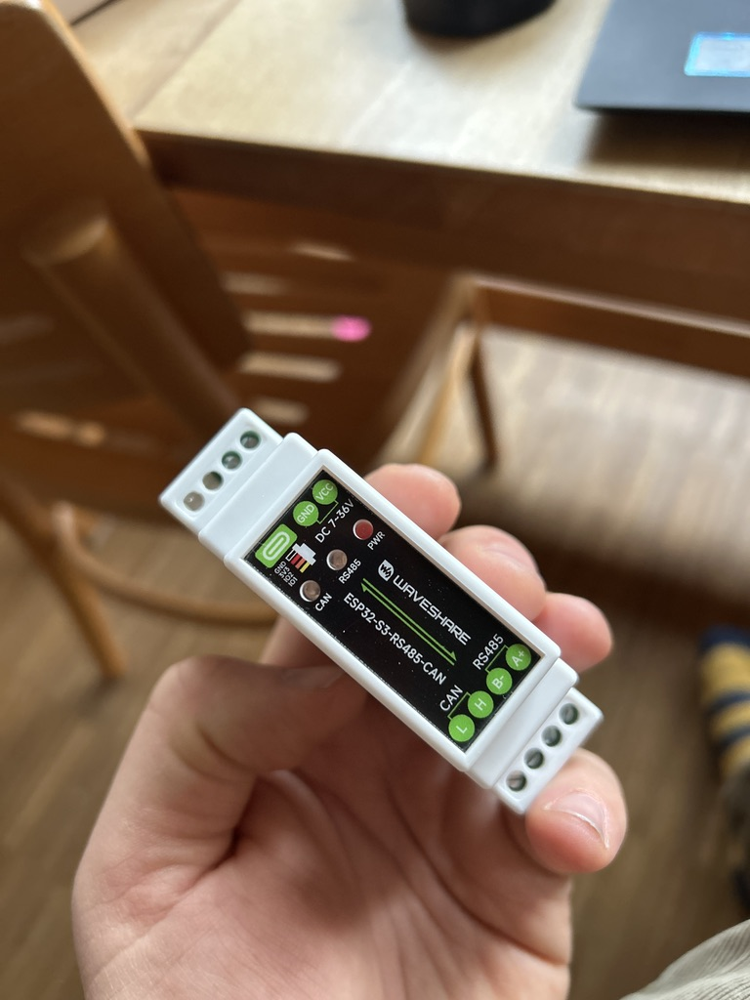
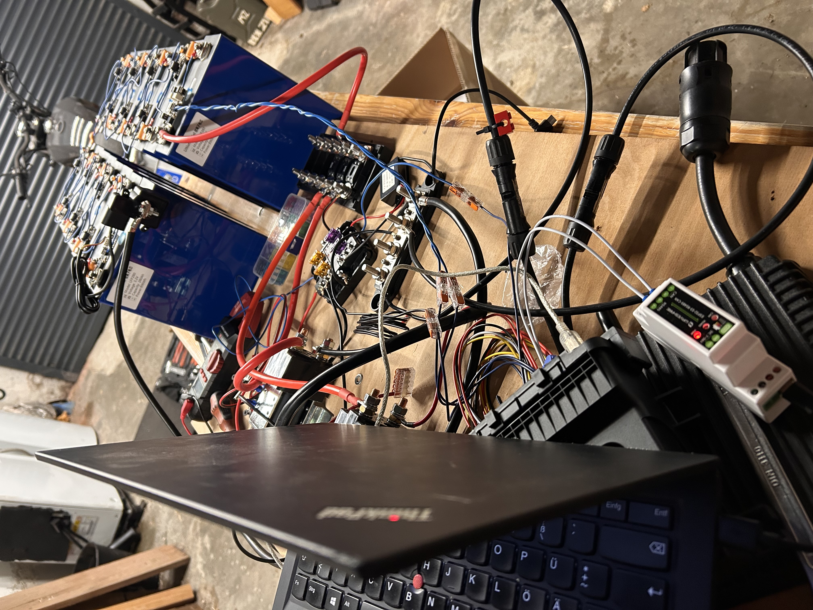

# 123smartbms CAN → MQTT Gateway (ESP32-S3)

  
  

---

## 🇩🇪 Deutsch

Dieses Projekt liest den **State of Charge (SOC)** aus einem **123smartbms** über den
**CAN-Bus** aus und stellt ihn per **MQTT** im Netzwerk zur Verfügung.

Die Implementierung orientiert sich eng an der funktionierenden Referenz-Firmware
und ist bewusst **minimal, stabil und bus-verträglich** ausgelegt.

---

### Funktionen

- CAN-Bus-Anbindung über **ESP32-S3 + Waveshare CAN Board**
- **250 kbit/s**, Standard-CAN-Frames (11-bit)
- **Aktiver CAN-Teilnehmer (TWAI_MODE_NORMAL)** mit ACK
- Auslesen von **SOC (CAN-ID 1, Byte 6)**
- MQTT-Publish **1× pro Minute**
- Keine RX-Queue-Überläufe
- Keine dauerhafte Bus-Blockierung
- Dauerbetrieb erprobt

---

### Hardware

- ESP32-S3  
- Waveshare CAN Board (SN65HVD-Serie oder kompatibel)  
- 123smartbms  
- CAN-Bus mit mindestens einem weiteren aktiven Teilnehmer  

---

### Pinbelegung

| Funktion | GPIO |
|--------|------|
| CAN TX | GPIO 15 |
| CAN RX | GPIO 16 |

---

### CAN-Details

- **Bitrate:** 250 kbit/s  
- **Frame-Typ:** Standard (11-bit)

**SOC-Frame:**

- CAN-ID: `1`
- Byte: `6`
- Wertebereich: `0–100` → SOC in %

**Beispiel:**
ID: 1
DATA: 00 00 1d 2b 00 96 31 00
^^
SOC = 0x31 = 49 %

---

### MQTT

**Topics:**

<pre>
bms/123smartbms/soc
bms/123smartbms/voltage_v
bms/123smartbms/current_battery_a
bms/123smartbms/current_in_a
bms/123smartbms/current_out_a
bms/123smartbms/power_battery_w
</pre>

**Payload:**

49

- Retained Message: ja
- Publish-Intervall: 1× pro Minute
- Publish erfolgt nur bei gültigem SOC

---

### Warum kein LISTEN_ONLY

Das **123smartbms** benötigt **ACKs auf dem CAN-Bus**.
Ein rein passiver Listener (`LISTEN_ONLY`) führt zu:

- wiederholten Retransmits
- dauerhaft leuchtender CAN-LED
- blockiertem oder instabilem Bus

➡️ Deshalb wird **bewusst `TWAI_MODE_NORMAL` verwendet**.

---

### Design-Entscheidungen

- CAN-Empfang hat Priorität
- MQTT ist zeitlich entkoppelt
- Keine serielle Ausgabe im RX-Pfad
- Alerts wie im Referenzcode
- Kein Webserver, kein unnötiger Overhead

---

## 🇬🇧 English

This project reads the **State of Charge (SOC)** from a **123smartbms** via the
**CAN bus** and publishes it to the network using **MQTT**.

The implementation closely follows the proven reference firmware and is intentionally
**minimal, stable, and CAN-bus-friendly**.

---

### Features

- CAN bus interface via **ESP32-S3 + Waveshare CAN board**
- **250 kbit/s**, standard CAN frames (11-bit)
- **Active CAN node (TWAI_MODE_NORMAL)** with ACK support
- Reads **SOC (CAN ID 1, byte 6)**
- MQTT publish **once per minute**
- No RX queue overflows
- No permanent CAN bus blocking
- Tested in continuous operation

---

### Hardware

- ESP32-S3  
- Waveshare CAN board (SN65HVD series or compatible)  
- 123smartbms  
- CAN bus with at least one additional active node  

---

### Pin Mapping

| Function | GPIO |
|--------|------|
| CAN TX | GPIO 15 |
| CAN RX | GPIO 16 |

---

### CAN Details

- **Bitrate:** 250 kbit/s  
- **Frame type:** Standard (11-bit)

**SOC frame:**

- CAN ID: `1`
- Byte: `6`
- Range: `0–100` → SOC in %

**Example:**

ID: 1
DATA: 00 00 1d 2b 00 96 31 00
^^
SOC = 0x31 = 49 %

---

### MQTT

**Topics:**

<pre>
bms/123smartbms/soc
bms/123smartbms/voltage_v
bms/123smartbms/current_battery_a
bms/123smartbms/current_in_a
bms/123smartbms/current_out_a
bms/123smartbms/power_battery_w
</pre>

**Payload:**

49

- Retained message: yes
- Publish interval: once per minute
- Published only when a valid SOC is available

---

### Why not LISTEN_ONLY

The **123smartbms** requires **ACKs on the CAN bus**.
Using a passive listener (`LISTEN_ONLY`) causes:

- repeated retransmissions
- permanently lit CAN LED
- unstable or blocked bus

Therefore, **`TWAI_MODE_NORMAL` is intentionally used**.

---

## License

MIT License – free to use, modify, and distribute.

---

## Disclaimer

This project is **not officially affiliated with 123smartbms**.
All product and company names are used for technical identification only.
